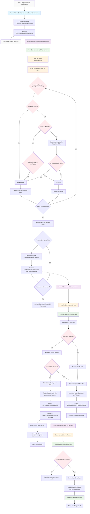

# Process Subscriptions Flow

This flowchart shows the complete data flow and decision points when `/trigger/process-subscriptions` endpoint is called.

```mermaid
flowchart TD
    A[POST /trigger/process-subscriptions] --> B[SubscriptionsController.processDueSubscriptions]

    B --> C[Dynamic Import ProcessDueSubscriptionsJob]
    C --> D[Dispatch ProcessDueSubscriptionsJob]
    D --> E[Return HTTP 200: 'queued']

    %% Main Processing Job
    F[ProcessDueSubscriptionsJob.process] --> G[CronService.getDueSubscriptions]
    D -.-> F

    %% Get Due Subscriptions Logic
    G --> H[Query enabled subscriptions]
    H --> I[Load subscription.user for each]
    I --> J{For each subscription:<br/>CronService.isDue?}

    %% Due Check Logic
    J --> K{lastRunAt exists?}
    K -->|No| L[Mark as due]
    K -->|Yes| M{nextRunAt exists?}
    M -->|Yes| N{DateTime.now >= nextRunAt?}
    M -->|No| O[Parse cron expression<br/>Calculate if due]
    N -->|Yes| L
    N -->|No| P[Not due]
    O --> Q{Is due based on cron?}
    Q -->|Yes| L
    Q -->|No| P

    %% Processing Due Subscriptions
    L --> R[Add to dueSubscriptions array]
    P --> S[Skip subscription]
    R --> T{More subscriptions?}
    S --> T
    T -->|Yes| J
    T -->|No| U[Return dueSubscriptions array]

    U --> V{For each due subscription}
    V --> W[Dynamic Import FetchSubscriptionDataJob]
    W --> X[Dispatch FetchSubscriptionDataJob with subscriptionId]
    X --> Y{More due subscriptions?}
    Y -->|Yes| V
    Y -->|No| Z[ProcessDueSubscriptionsJob Complete]

    %% Individual Subscription Processing
    AA[FetchSubscriptionDataJob.process] --> BB[Load subscription with user]
    X -.-> AA
    BB --> CC[SecureDataFetcher.fetchData]

    %% Secure Data Fetching
    CC --> DD[Validate URL security]
    DD --> EE{URL valid and safe?}
    EE -->|No| FF[Throw security error]
    EE -->|Yes| GG[Make HTTP GET request]
    GG --> HH{Request successful?}

    %% Success Path
    HH -->|Yes| II[Validate content type is JSON]
    II --> JJ[Return FetchResult with data, status, headers]
    JJ --> KK[Import SendSubscriptionEmailJob]
    KK --> LL[Dispatch SendSubscriptionEmailJob with data]
    LL --> MM[CronService.markAsRun]
    MM --> NN[Update lastRunAt, calculate nextRunAt]
    NN --> OO[Save subscription]

    %% Error Path
    HH -->|No| PP[CronService.markAsFailed]
    FF --> PP
    PP --> QQ[Increment failureCount, set lastFailureAt]
    QQ --> RR[Import SendSubscriptionFailureEmailJob]
    RR --> SS[Dispatch failure notification]

    %% Email Processing (Success)
    TT[SendSubscriptionEmailJob.process] --> UU[Load subscription with user]
    LL -.-> TT
    UU --> VV[BouncerHelper.canSendEmail]
    VV --> WW{User can receive emails?}
    WW -->|No| XX[Log: User cannot receive emails]
    WW -->|Yes| YY[Import SendEmailJob]
    YY --> ZZ[Dispatch SendEmailJob with formatted data]

    %% Email Logging and Final Steps
    ZZ --> AAA[EmailLogService.logEmail]
    AAA --> BBB[Save email log record]

    %% Styling
    classDef controller fill:#e1f5fe
    classDef job fill:#f3e5f5
    classDef service fill:#e8f5e8
    classDef model fill:#fff3e0
    classDef decision fill:#ffebee
    classDef external fill:#fafafa

    class B controller
    class F,AA,TT job
    class G,CC,VV,AAA service
    class H,I,BB,UU model
    class J,K,M,N,Q,EE,HH,WW decision
    class A,E external
```
